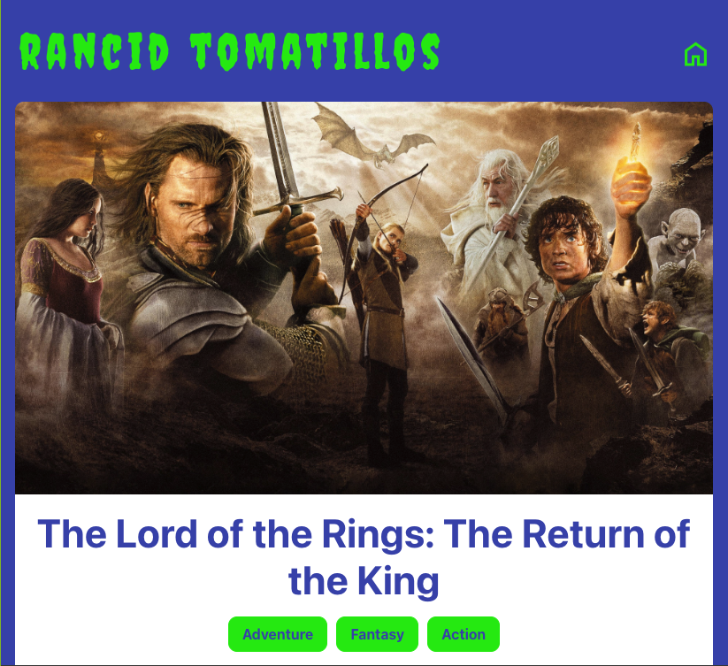

# Rancid Tomatillos

## Project Goals

This project was designed and implemented over a 10 day sprint by a team of two developers. This project is a movie catalogue to display movie posters, vote on movie ratings, and access details about movies. The goal was to build website functionality around an existing API. 

## Deployment Link
[Link To Website](https://rancid-tomatillos-omega-lake.vercel.app/)

## Technologies

**Core**

* React (v18.3.1)
* React Router Dom (v6.27.0)
* React Scripts (v5.0.1)

**Testing**

* Cypress (v13.14.2)

## App

**HomeScreen**

**Details Page**

### Contributors

**Joe Chirchirillo**
   - [Github](https://github.com/jchirch)
   - [LinkedIn](https://www.linkedin.com/in/joechirchirillo/)

**Candice Cirbo**
   - [Github](https://github.com/CCirbo)
   - [LinkedIn](https://www.linkedin.com/in/candicecirbo/)
