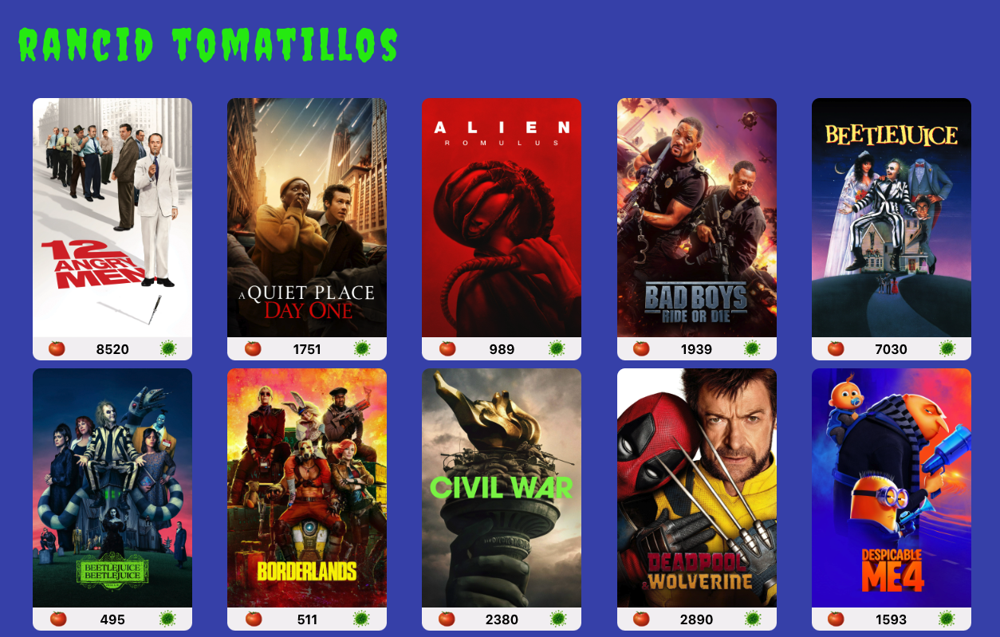

# Rancid Tomatillos

## Project Goals

This project was designed and implemented over a 10 day sprint by a team of two developers. This project is a movie catalogue to display movie posters, vote on movie ratings, and access details about movies. The goal was to build website functionality around an existing API. 

## Deployment Link
xxxxxx

## Technologies

**Core**

* React (v18.3.1)
* React Router Dom (v6.27.0)
* React Scripts (v5.0.1)

**Testing**

* Cypress (v13.14.2)

## App

**HomeScreen**

**Details Page**

### Contributors

**Joe Chirchirillo**
   - [Github](https://github.com/jchirch)
   - [LinkedIn](https://www.linkedin.com/in/joechirchirillo/)

**Candice Cirbo**
   - [Github](https://github.com/CCirbo)
   - [LinkedIn](https://www.linkedin.com/in/candicecirbo/)

<!-- 

# Rancid Tomatillos - Starter Repo

## [The project spec for Rancid Tomatillos can be found here.](https://curriculum.turing.edu/module3/projects/rancid-tomatillos)

## Set Up
1.  Fork this repo
2.  Clone **and rename** this repo: `git clone [remote-address] [new-name]`  
   For example: `git clone git@github.com:turingschool-examples/rancid-tomatillos-starter.git rancid-tomatillos`
4.  `cd` into the directory
5.  Install necessary dependencies with `npm install`
6.  Run your React app with `npm start`
7.  Go to `http://localhost:3000/` and you should see a page with some starter elements
8.  Enter `control + c` in your terminal to stop running the React app at any time
9. To run Cypress tests, use `npx cypress open` -->
